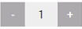

# jquery.quantity-pluser
<br>
Кнопки + и - для указания количества в input 
Плагин делает вставку кнопок <button> до и после input - минус и плюс соответственно. Плюсует и вычитает значения в input с заданым шагом, в заданом диапазоне, так же манипулирует значениями при ручном вводе в поле input. Часто нужно в интернет магазинах.

## Установка
```bash
<script type="text/javascript" src="jquery.quantitypluser.js"></script>
```

### HTML
```bash
<div class="quantity">
  <input type="text" size="3" title="Количество" value="1" id="quantity">
</div>
```
### CSS
```bash
.quantity {
  -webkit-user-select: none;
  -moz-user-select: none;
  -ms-user-select: none;
  user-select: none; }
  .quantity > input {
    width: 40px;
    height: 30px;
    border: 0;
    background-color: #efefef;
    text-align: center;
    position: relative;
    z-index: 10; }
  .quantity > .before, .quantity > .after {
    width: 30px;
    height: 30px;
    background-color: #acabac;
    line-height: 28px;
    display: inline-block;
    color: #fff;
    text-align: center;
    position: relative;
    z-index: 5;
    cursor: pointer;
    border: 0; }
    .quantity > .before:disabled, .quantity > .after:disabled {
      cursor: not-allowed; }
```

## Использование
```bash
$('#quantity').quantityPluser(options);
```
### Options

| *Название* | *Тип*  | *По умолчанию* | *Описание* |
|:-----------|:-------|:---------------|:---------------------------------------------------------------------------|
| **before**     | String			 | before         | Имя css класса для кнопки вставляемой перед input - кнопка минус  |
| **after**     | String 		 | after          | Имя css класса для кнопки вставляемой после input - кнопка плюс   |
| **max**       | Int   			 | null           | Максимально возможное значение. Значение `null` - без ограничений |
| **min**       | Int   		   | null           | Минимально возможное значение. Значение `null` - без ограничений  |
| **step**      | int    		 | 1              | Шаг сложения и вычитания.		|
| **callback**  | function    | false              | Фунция вызывается после изменения в поле input                    |

## Пример
```bash
$('#quantity').quantityPluser({
	min: 1,
	max: 15
}).change(function(value) {
	console.log('Value change: ' + value);
});
```
